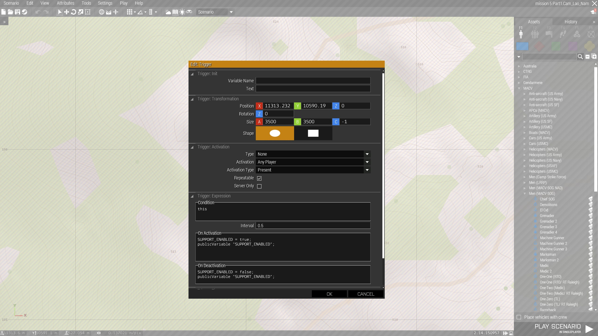

# Arma3 MACV-SOG Columbia
## Scripts

<details>

<summary>1. Save loadout at arsenal</summary>

To save your loadout, add the below code in the arsenal 'init' section. 

```
this addAction [
"Save loadout",
{player setVariable["saved_loadout",getUnitLoadout player];
hint "Loadout saved";},
nil,
1.5,
true,
true,
"",
"_this distance _target < 2",
50,
false,
"",
""
];
```

Then, by looking at the arsenal (from 2 meters maximum) and using the scroll wheel, you will have the option to 'save loadout'.
</details>

<details>

<summary>2. Add image on map stand</summary>

To display any image on a map stand, follow the below steps:
- convert your .png into one of these resolution: 256x256, 512x512, 1024x1024 or 2048x2048
- use the TexView 2 (Arma 3 Tool) to convert the .png into a .paa (Use 'RGBA' and in the other section use 'DXT5')
- add .paa file into the 'images' folder
- add the below code in the 'init' section of the map stand

  ```
  this setObjectTexture [0,
  "images\YOUR_IMAGE.paa"]
  ```

</details>

<details>

<summary>3. Prairie Fire Radio Support</summary>

<h3>Allow Radio Support based on trait</h3>
Radio support from the Prairie fire DLC is available in a mission if all of the below points are true for a player:
- Radio Support module is present in the mission
- The player has the following radio (should only be the case for RTO if no Covey in a mission):

  ```
  "vn_b_pack_lw_06"
  ```

- Or if the player is flying the
  
  ```
  "pook_skymaster_NATO_B"
  ```
  
- (IF unit_trait_required = 1 in description.ext) Player has the below code in its 'init' section

  ```
  this setUnitTrait["vn_artillery", true, true];
  ```

- All this can be modified in the vn_artillery_settings class in [artillery.hpp](https://github.com/gerard-sog/arma3-macvsog-columbia-scripts/blob/main/functions/artillery.hpp)

<h3>Enable/Disable Radio Support based on distance from a FOB</h3>
Here is how we emulate FOB with artillery support capabilities. By this we mean that the FOB can provide artillery support 
within a perimeter (it will be 3.5km in our example).

- To do so, we use a public variable called 'SUPPORT_ENABLED' defined in [initServer.sqf](https://github.com/gerard-sog/arma3-macvsog-columbia-scripts/blob/main/initServer.sqf) and it is used as the condition in [artillery.hpp](https://github.com/gerard-sog/arma3-macvsog-columbia-scripts/blob/main/functions/artillery.hpp).

  ```
  SUPPORT_ENABLED = true; // Used with the artillery support from Prairie Fire. By default condition on artillery strike will be true thanks to this public variable.
  publicVariable "SUPPORT_ENABLED";
  ```

- then add a trigger that updates that variable (see example below).
  - Condition:
    ```
    this
    ```
  - On Activation:
    ```
    SUPPORT_ENABLED = true; 
    publicVariable "SUPPORT_ENABLED";
    ```
  - On Deactivation:
    ```
    SUPPORT_ENABLED = false; 
    publicVariable "SUPPORT_ENABLED";
    ```
  <details>
  <summary><b>see image <--- </b></summary>

  
</details>
</details>

<details>

<summary>4. Add teleport flag</summary>

To add a teleport flag (or any other object that player can use to teleport themselves at a predetermined point) follow the below steps:
- Add a invisible marker (point) on the map in editor and give it a name (ex: "airfield")
- add the below code in the 'init' section of the teleport flag (or object you choose)

  ```
  this addAction [
      "Travel to airfield", // This text will be displayed in the action menu (using the scroll wheel).
  {
      (_this select 1) setPos (getMarkerPos "airfield");} // This section will teleport the player to the position of the "airfield" marker.
  ];
  ```

</details>

<details>

<summary>5. Force vietnamese face on players</summary>

N.B: Roles 1-0, 1-1 and 1-2 will not be impacted by the face change since they were US soldiers.

Playing as early MACV-SOG team, we are playing as south vietnamese thus we force vietnamese faces on all playable character. 
At player initilization or at player respawn, one random asian face is selected from the below list and set for the current player.

```
[
    "vn_b_AsianHead_A3_06_02",
    "vn_b_AsianHead_A3_07_02",
    "vn_b_AsianHead_A3_07_03",
    "vn_b_AsianHead_A3_07_04",
    "vn_b_AsianHead_A3_07_05",
    "vn_b_AsianHead_A3_07_06",
    "vn_b_AsianHead_A3_07_07",
    "vn_b_AsianHead_A3_07_08",
    "vn_b_AsianHead_A3_07_09"
]
```

To disable this feature, you can comment or remove the below line from [initPlayerlocal.sqf](https://github.com/gerard-sog/arma3-macvsog-columbia-scripts/blob/main/initPlayerlocal.sqf) and [onPlayerRespawn.sqf](https://github.com/gerard-sog/arma3-macvsog-columbia-scripts/blob/main/onPlayerRespawn.sqf):

```
call COLUMBIA_fnc_faces;
```

You can also directly execute the below command on the server to directly reset all players faces to a random asian face:
```
call COLUMBIA_fnc_faces;
```

</details>

<details>

<summary>6. Add drinkable beer</summary>

To create a drinkable beer (or any other object that player can use) follow the below steps:
- Add the beer object 'Savage Bia'
- add the below code in the 'init' section of the beer (or object you choose)

  ```
  this addAction ["Drink Beer", { 
      "dynamicBlur" ppEffectEnable true; 
      "dynamicBlur" ppEffectCommit 1; 
      "dynamicBlur" ppEffectAdjust [6]; 
      addCamShake [5, 60, 1];
      sleep 4; 
      "dynamicBlur" ppEffectEnable false;
  }];
  ```

</details>

<details>

<summary>7. JBOY mace trap</summary>

```
/* **********************************************************************
JBOY Mace Punji Trap demonstration mission.
Author:  Johnnyboy
Credits: Savage Game Design for the objects and sound files used by this script.

HOW TO ADD THESE TRAPS TO YOUR MISSION
======================================
1.  Include the compile code below in your init.sqf
2. Place a Whip Trap object in the editor.  The direction you set the trap 
will be the direction the mace will swing.
Note that AI may be inclined to walk around the trap, so you might want to place more
objects to funnel the AI path to the trap.
3. In the Whip Trap object's init field, put the following code:

[this,'WEST'] spawn {sleep 3; params ["_trap","_triggerActivatedBy"];[_trap,_triggerActivatedBy] spawn JBOY_maceTrapCreate;};

The second parameter above determines who can activate the trap.  
This script creates a trigger for the trap, so these are the values you can
use for this parameter:
"EAST", "WEST", "GUER", "CIV", "LOGIC", "ANY", "ANYPLAYER"

For a Prairie Fire mission you might want to set it to WEST so only West units
activate the trap.  This simulates the locals (VC and Civs) knowing to avoid the trap.

SCRIPT FEATURES
================
- Direction of mace swing determined by direction of placed Whip Trap (that has call to this script in init)
- What side can activate trap is configurable
- Maximum Sound FX for immersion: (trap activation, screams, swinging rope creaking)
- Weapon flies when hit by mace
- Multiple random death animations for when impaled on mace
- Other AI units in group react to mace when a unit hit
- AI units in group react to mace if mace misses them

*************************************************************************/

// **********************************************************************
// Place the following in your mission's init.sqf
// **********************************************************************
// **********************************************************************
// Compile general JBOY functions
// **********************************************************************
_n = execVM  "functions\JBOY\JBOY_compileFuncs.sqf"; // Compile general JBOY functions
call compile preprocessFile "functions\JBOY\mace\compileMaceScripts.sqf"; // Compile all Mace functions
```

</details>

<details>

<summary>8. ACRE2</summary>

<h3>Babel</h3>
Babel configuration: [init.sqf](https://github.com/gerard-sog/arma3-macvsog-columbia-scripts/blob/main/init.sqf)

Key to change languages: 'Right Alt'

We are using Babel to provide the following behaviour during our MACVSOG missions:
- Have the MACVSOG team able to talk and understand each other (using English)
- Have some members of the MACVSOG team that could speak and understand Vietnamese (be used as translator) by adding the below line in the 'init' section of the playable unit
  ```
  this setVariable ["f_languages",["en", "vn"]];
  ```
  
- Have the Zeus player speak Vietnamese when controlling an OPFOR unit. This makes the dialog between OPFOR and MACVSOG team possible only via the members speaking English and Vietnamese.

<h3>Adding PRC77 Racks to planes</h3>

Here are the steps to follow if you want to add 2 news acre radio racks to planes (child from 'Plane_Base_F' class):
- Place a plane in the editor or during a mission
- During the mission a player/zeus must enter the plane once in order to initialize ACRE radios in the plane
- Use the zeus module implemented in [columbia_zeus_initpf77rack.sqf](https://github.com/gerard-sog/arma3-macvsog-columbia-scripts/blob/main/functions/columbia_zeus_initpf77rack.sqf) and click on the plane you want to add 2 racks of PRC77 radios
- The plane will now have 2 more racks of PRC77 radios

</details>

<details>

<summary>9. Fuel consumption</summary>

Here is the code to place in the 'init' section of the vehicle you to change the fuel consumption of:
  ```
  _this setFuelConsumptionCoef 3; // Fuel consumption will be 3x default consumption.
  ```

</details>

<details>

<summary>10. Tracker module</summary>

To turn ON/OFF tracker module, simply put the bellow code in the 'init' section of the tracker module:
  ```
  TRACKERS_ENABLED
  ```
This variable is initially set to 'false' but can be updated during the mission using the "Toggle Trackers" zeus module.

</details>

## Default values

- Default <b>addons</b> for missions: [defaultAddons.txt](https://github.com/gerard-sog/arma3-macvsog-columbia-scripts/blob/main/default/defaultAddons.txt)
- Default <b>loadouts</b>: [loadouts](https://github.com/gerard-sog/arma3-macvsog-columbia-scripts/blob/main/default/loadouts/)
- Default whitelist <b>arsenal</b>: [defaultWhitelistArsenal.txt](https://github.com/gerard-sog/arma3-macvsog-columbia-scripts/blob/main/default/defaultWhitelistArsenal.txt)
- Default <b>missions</b>:
    - [Cam_Lao_Nam](https://github.com/gerard-sog/arma3-macvsog-columbia-scripts/blob/main/default/missions/DefaultMission.Cam_Lao_Nam/mission.sqm): Includes borders between ARVN (South Vietnam), PAVN (North Vietnam), Khmer Republic, Laos and Cambodia.
